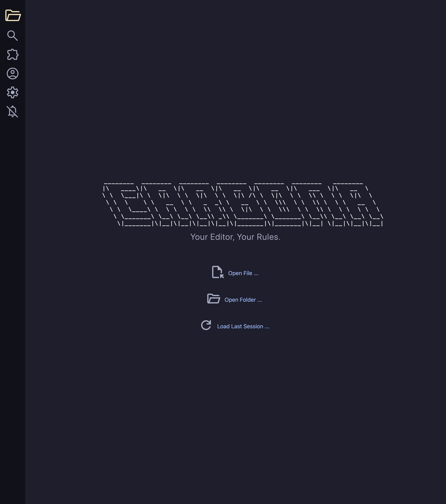

# Carbona Editor
> Your Tool, Your Rules.

Carbona is a modern, lightweight and customizable IDE. 

## Contributing
We appreciate any contribution to this project. We'll need
* Translation
* Pull requests
* Plugins
* Documentations

If you are interested to contribute, please read CONTRIBUTING.md for more details.

## Build
1. Clone the respository.
2. Run `npm install` in the project root folder.
3. Run `npm run dev` to start the electron app.

